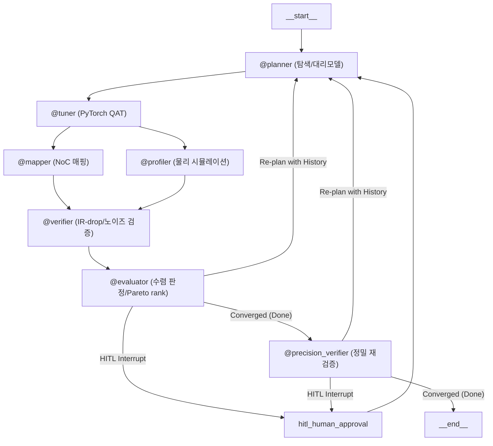

# AutoCIM-Agent

**CIM(Compute-In-Memory) 반도체를 위한 LangGraph 기반 7-에이전트 HW-SW 공동설계 최적화 프레임워크**

레이어별 양자화 비트/컬럼 프루닝 비율과 크로스바 하드웨어 제약(ADC/DAC 해상도, IR-drop, 소자 노이즈)을 함께 고려해, 정확도·에너지·지연시간의 Pareto 최적점을 자율적으로 탐색하는 폐루프(closed-loop) 에이전트 파이프라인입니다. 배경과 전체 설계 의도는 [`docs/research_plan.md`](docs/research_plan.md)를, 코드 작성 규칙은 [`CLAUDE.md`](CLAUDE.md)를 참고하세요.

## 아키텍처



| 에이전트 | 역할 | 실제 구현 여부 |
|---|---|---|
| `@planner` | LHS 워밍업 + IDW 대리모델 기반 다중목적(accuracy/energy_pj/noc_latency_ms) NSGA-II 탐색(`pymoo`, stage별 독립, 최대 40차원)이 수치를 확정하고, LLM은 도구 호출로 근거(rationale) 설명과 이상 징후(anomaly) 플래깅만 담당 (수치 판단 없음) | 실제 |
| `@tuner` | 크로스바 컬럼(출력 채널)별 독립 스케일을 쓰는 column-wise 가중치 fake-quantization + partial-sum(ADC 직전 출력) 양자화 + 구조적 컬럼 프루닝, 실제 QAT fine-tuning (`tools/qat.py`) | 실제 (CIFAR10 서브셋, CUDA/MPS/CPU 자동 감지) |
| `@mapper` / `@profiler` | NoC 홉카운트/대역폭 매핑, ADC/DAC/크로스바 에너지·지연 물리 시뮬레이션 | 실제 (fast-approximation) |
| `@verifier` | IR-drop/노이즈 마진 기반 수렴 판정 | 실제 |
| `@evaluator` | Pydantic 스키마 검증, NSGA-II 스타일 Pareto rank, 재탐색/HITL 라우팅 | 실제 |
| `@precision_verifier` | `@evaluator`가 수렴으로 판단한 후보만 골라 2단계 정밀 재검증하고, 그 결과로 `calibration_factors`를 갱신 (`tools/precision_check.py`) | Mock First (실제 정밀 시뮬레이터 자리 표시자, 인터페이스/그래프 라우팅은 실제) |

> **스코프 한계 (의도적으로 문서화됨):** `@mapper`/`@profiler`는 NeuroSim/CIM-Loop 같은 정밀 시뮬레이터가 아니라 물리 법칙 기반의 fast-approximation이며(`calibration_factors`로 보정), `@tuner`의 학습 데이터는 CIFAR10 512/128/1000장 서브셋입니다. `@precision_verifier`도 같은 이유로 현재는 Mock First 자리 표시자입니다(실제 정밀 시뮬레이터 바인딩 전). 후보 간 **상대 비교**에는 신뢰할 수 있지만, 절대 수치를 그대로 벤치마크/제품 스펙으로 사용하지 마세요.
>
> **NSGA-II 서로게이트의 데이터 규모 한계:** `@planner`의 NSGA-II(`pop_size=200`, `n_generations=30`)는 실제 후보가 아니라 IDW 대리모델(surrogate) 예측값 위에서 돌아갑니다. 이 대리모델은 세션당 최대 12개(`_MAX_WARMUP_CANDIDATES`)의 실측 워밍업 후보로 학습되는데, 탐색 공간 자체는 `2 × stage 수`차원(mobilenet_v2 기준 20 stage → 40차원)이라, 세대를 거듭할수록 진짜로 정교해지는 다중목적 탐색이라기보다 소수의 실측 데이터 주변을 폭넓게 보간하는 수준입니다. "진짜 NSGA-II"라는 표현이 구현의 사실(실제 pymoo 알고리즘을 씀)을 가리키는 것이지, 이 정도 데이터로 뒷받침되는 통계적 신뢰도를 의미하는 건 아닙니다.

## 설계 근거 (CIM 가속기 연구 동향과의 연결)

이 프로젝트의 핵심 설계 선택들은 임의로 고른 게 아니라, 실제 CIM 가속기 연구에서 반복적으로 다뤄지는 문제들을 코드 수준에서 재현/검증해보는 것을 목표로 했습니다.

- **다중목적(Multi-objective) 탐색이 정확도 하나만 보지 않음**: `tools/search.py`는 정확도뿐 아니라 `energy_pj`/`noc_latency_ms`까지 세 가지 목적을 동시에 최적화하는 진짜 NSGA-II(`pymoo`)를 씁니다. 초기 버전은 정확도만 대리모델링하고 에너지/지연은 사후 랭킹에만 쓰는 한계가 있었는데(=사실상 단일목적), 실제 실행 로그로 이 한계를 확인한 뒤 다중목적 acquisition으로 교체했습니다 — "실측 데이터로 설계를 검증하고 고친다"는 태도 자체를 코드/커밋에 남기려 한 부분입니다.
- **Column-wise quantization — 가중치와 partial-sum 둘 다**: `tools/qat.py`의 fake-quantization은 레이어 전체가 스케일 하나를 공유하지 않고, 크로스바 컬럼(출력 채널)마다 독립적인 양자화 스케일을 씁니다. 실제 크로스바에서 컬럼마다 가중치 분포가 크게 다를 수 있다는 점, 그리고 컬럼마다 물리적으로 분리된 read-out 경로를 갖는다는 점을 반영한 선택입니다. 같은 resnet18 가중치로 측정했을 때 4-bit 기준 conv/downsample 레이어별 59~94%의 양자화 오차(MSE) 감소를 확인했습니다 (컬럼 간 가중치 크기가 거의 균일한 `fc` 레이어처럼 애초에 불균형이 없는 경우는 개선폭이 미미한 게 정상입니다). 여기서 더 나아가, ADC가 실제로 읽어내는 건 가중치가 아니라 크로스바 컬럼의 아날로그 누적값(partial sum)이라는 점에 착안해, 레이어 출력 자체도 `HWConfig.adc_bits` 정밀도로 컬럼별 독립 양자화합니다 — 가중치 정밀도와 무관하게 ADC 해상도 자체가 만드는 오차를 별도로 시뮬레이션에 반영한 것입니다 (`adc_bits`는 스테이지별 탐색 대상이 아니라 칩 전체가 공유하는 물리 상수이므로, `@planner`가 아니라 `HWConfig`에서 옵니다).
- **ADC/DAC 물리 한계가 탐색 알고리즘을 실제로 제약**: `nodes/planner.py`의 `search_bounds()`는 `weight_bits`의 탐색 상한을 `min(adc_bits, dac_bits)`로 강제합니다 — "정책상 원하는 비트 수"가 아니라 "이 하드웨어가 물리적으로 표현 가능한 비트 수"가 탐색 공간 자체를 정의합니다.
- **근사 물리 모델의 신뢰도를 스스로 검증**: `tools/calibration.py`는 분석적 에너지 추정치를 실제 문헌값(NeuroSim 벤치마크, RRAM/SRAM/MRAM/DARAM/FeFET 등 여러 소자별 실측 칩 논문 8건, 다양한 array 크기·ADC 해상도·공정 조합)과 대조해 보정 계수를 매깁니다. 기본값은 정확히 일치하는 참조가 없어도 가장 가까운 참조의 보정 계수를 근사 적용하는 것이고(`--exact-calibration-only`로 예전처럼 엄격한 미보정 상태로 되돌릴 수 있음), 어느 쪽이든 정확한 인용인지 근사 추정인지는 `tools/dashboard.py`의 캘리브레이션 배지에 항상 정직하게 표시됩니다.
- **IR-drop/소자 노이즈를 수렴 조건에 직접 반영**: `@verifier`는 정확도가 좋아도 배선 저항/소자 노이즈로 인한 물리적 실패(`ir_drop_error_pct`, `noise_margin_db`)가 있으면 수렴으로 인정하지 않습니다 — 소프트웨어 지표만으로 "완성"을 선언하지 않는다는 원칙입니다.
- **2단계 다중 충실도(Multi-fidelity) 검증**: 정밀 시뮬레이터(NeuroSim/CIM-Loop 등)는 회로 연산이 포함돼 있어 탐색 중인 모든 후보를 검증하기엔 비용이 큽니다. 이 프로젝트는 `@evaluator`의 fast-approximation이 수렴으로 판단한 (탐색 전체가 아니라 극히 일부인) 후보만 골라 `@precision_verifier`에서 다시 검증하고, 그 결과로 `calibration_factors`를 자동 갱신해 이후 후보들의 근사 정확도까지 함께 개선하는 폐루프를 구성했습니다. 실제 세션에서 확인한 예: 11번째 반복에서 근사 모델이 `energy_pj=69.72416`으로 수렴 판정했고, 2단계 재검증이 `73.210368`(보정 계수 `1.05x`)을 산출해 최종 수렴 및 `calibration_factors`/`calibration_provenance` 갱신까지 그래프 라우팅 그대로 이어짐을 확인했습니다. 현재 `@precision_verifier`의 계산 자체는 Mock First(`CLAUDE.md` 5.D) 자리 표시자이고, 검증된 것은 그래프 라우팅·state 갱신·캘리브레이션 피드백 루프 구조입니다 (실제 정밀 시뮬레이터 바인딩은 로드맵 참고).

## 주요 기능
- **로컬 우선 LLM**: `@planner`는 기본적으로 로컬 Ollama 모델(`ollama:qwen2.5:7b`)을 사용 -- 하드웨어 스펙이 외부로 나가지 않음. `AUTOCIM_PLANNER_MODEL`로 클라우드 provider를 opt-in 가능
- **세션 영속성**: `SqliteSaver` 기반 체크포인트로 프로세스 재시작 후에도 `--thread-id`로 재개
- **HITL(Human-in-the-Loop)**: 수렴 정체 시 연구원 개입 요청 (dynamic `interrupt()`)
- **LLM 호출 운영**: 재시도/지수 백오프, rate-limit 대응, 토큰/비용 추적, 누적 비용·토큰 상한(kill-switch)
- **구조화된 관측성**: iteration별 JSON Lines 로그(`observability.py`) + 후보/Pareto front 이동을 보여주는 HTML 대시보드(`tools/dashboard.py`)
- **GPU 자동 감지**: `tools/qat.py`가 CUDA → Apple MPS → CPU 순으로 자동 감지 (`AUTOCIM_QAT_DEVICE`로 override 가능)
- **병렬 워밍업**: LHS 워밍업 후보들은 서로 독립적이므로, 새 세션 시작 시 순차 그래프 루프 진입 전에 스레드 풀에서 한번에 동시 평가 (`tools/batch_warmup.py`) -- HITL 개입 없이 워밍업 전체가 자동으로 끝남. 스레드 수는 `--parallel-warmup-workers`로 조절 가능

## 설치

가상환경 사용을 권장합니다 (전역 site-packages와의 충돌 방지 -- 아래 "문제 해결" 참고). `torch`/`torchvision`은 버전만 고정돼 있고 실제 wheel(CPU 전용 vs CUDA)은 어느 index에서 설치하느냐로 결정되므로, **처음부터 아래 명령으로 명시적으로 골라서 설치**하세요 -- index 없이 `pip install -r requirements.txt`만 먼저 실행한 뒤 나중에 다른 wheel로 바꾸려 하면, pip가 버전 번호(`2.13.0`)만 보고 "이미 설치됨"으로 판단해 `--index-url`을 바꿔도 조용히 무시합니다(`--force-reinstall` 없이는 안 바뀜 -- 아래 "문제 해결" 참고).

**Windows/Linux** (기본값: GPU/CUDA -- 이 wheel은 CPU 연산도 그대로 지원하므로 GPU가 없어도 문제없이 동작합니다. 용량만 CPU 전용보다 큽니다):

```bash
python -m venv .venv
.venv/Scripts/activate  # Windows; Linux는 source .venv/bin/activate
pip install torch==2.13.0 torchvision==0.28.0 --index-url https://download.pytorch.org/whl/cu130
pip install -r requirements.txt
```

다운로드 용량을 줄이고 싶거나 GPU를 아예 쓸 계획이 없다면(CI/Docker가 이 방식 사용) CPU 전용으로:

```bash
pip install torch==2.13.0 torchvision==0.28.0 --index-url https://download.pytorch.org/whl/cpu
pip install -r requirements.txt
```

**macOS**: CUDA index 자체가 없습니다 (Apple Silicon은 MPS). index-url 없이 그냥 설치하면 됩니다:

```bash
python -m venv .venv
source .venv/bin/activate
pip install -r requirements.txt
```

설치 후 `python -c "import torch; print(torch.__version__); print(torch.cuda.is_available())"`로 어느 wheel이 깔렸는지/GPU 인식 여부를 확인할 수 있습니다. 새 venv에서 위 순서대로 설치 후 `pytest`까지 정상 통과하는 걸 확인했습니다 (282개 테스트).

## 실행

`@planner`(llm.py)는 기본적으로 **로컬 Ollama 모델**(`ollama:qwen2.5:7b`)을 사용합니다 -- 하드웨어 스펙/후보 설정을 외부 클라우드로 보내지 않아도 되도록, IP에 민감한 배포(반도체 회사 등)를 염두에 둔 기본값입니다. 처음 실행 전 한 번만:

```bash
# https://ollama.com 에서 Ollama 설치 후
ollama pull qwen2.5:7b
ollama serve   # 보통 설치 시 자동으로 백그라운드 서비스로 등록됨

python main.py --model-id resnet18 --dashboard-out report.html
```

클라우드 provider를 쓰고 싶으면 `AUTOCIM_PLANNER_MODEL`을 설정하면 됩니다 (`langchain.chat_models.init_chat_model` 스펙 문자열). `.env.example`을 `.env.local`로 복사해 값을 채우면 -- `main.py`가 실행할 때마다 자동으로 읽어들이므로 (import 시점이 아니라 `python main.py` 실행 시점에만; gitignore됨) -- 터미널을 새로 열 때마다 다시 `export`할 필요가 없습니다:

```bash
cp .env.example .env.local
# .env.local을 열어 AUTOCIM_PLANNER_MODEL과 해당 provider의 API 키를 채우기

python main.py --model-id resnet18 --dashboard-out report.html
```

또는 기존처럼 셸에서 직접 `export`해도 동일하게 동작합니다:

```bash
export AUTOCIM_PLANNER_MODEL="anthropic:claude-sonnet-4-5-20250929"
export ANTHROPIC_API_KEY="..."

python main.py --model-id resnet18 --dashboard-out report.html
```

`@planner`는 `PlannerLayerDecision`을 forced tool-calling(`tool_choice=<정확한 도구 이름>`)으로 호출하는데, 이걸 실제로 지원하지 않거나 필수 필드를 빠뜨리는 provider/모델도 있습니다. 아래는 실제로 end-to-end(실제 resnet18/mobilenet_v2+CIFAR10 QAT 포함, 10~20-stage `layer_configs` 리스트 전부)로 검증된 조합입니다:

| Provider | 모델 | 비고 |
|---|---|---|
| Ollama (로컬, 기본값) | `ollama:qwen2.5:7b` | resnet18(10 stage)/mobilenet_v2(20 stage) 전부 검증됨. `qwen2.5:14b`는 이 프로젝트의 forced tool-calling 프롬프트에서 오히려 빈 응답을 자주 반환해 비권장 |
| Anthropic | `anthropic:claude-sonnet-4-5-20250929` | 클라우드 중 기본 권장 |
| Groq (무료 티어 가능) | `groq:llama-3.3-70b-versatile` | `llama-3.1-8b-instant`는 `LayerBitConfig`의 필수 필드(`activation_bits`)를 종종 빠뜨려 실패함 -- 더 작은 모델로 바꾸기 전에 스키마 준수를 직접 확인할 것 |
| Google Gemini (무료 티어 가능) | `google_genai:gemini-3.5-flash-lite` | 스키마 준수 확인됨, 토큰 소모 적음. `gemini-3.5-flash`도 되지만 내부 reasoning 토큰 때문에 같은 요청에 ~2배 더 많은 토큰을 씀 |

Groq/Gemini를 쓰려면 `pip install -r requirements.txt`에 이미 포함된 `langchain-groq`/`langchain-google-genai`가 필요하고, 각각 `GROQ_API_KEY`/`GOOGLE_API_KEY` 환경변수를 설정하면 됩니다.

**`--hw-config`를 생략하고 터미널에서 직접 실행하면**, 매번 JSON 파일 경로를 손으로 쓰는 대신 대화형으로 물어봅니다: (1) 커스텀 값 직접 입력 (2) 저장된 예시 파일(`examples/hw_configs/`) 중 선택 (3) 기본값 사용. 직접 입력 시 각 필드에서 `b`(또는 `back`/`뒤로`)를 입력하면 바로 앞 필드로 돌아가 다시 입력할 수 있고(맨 첫 필드에서 입력하면 [1]/[2]/[3] 메뉴로 돌아감), 스키마 검증에 실패해도(예: `noc_topology`에 오타) 이미 입력한 다른 필드는 그대로 유지된 채 문제된 필드만 원래 기본값으로 재설정됩니다. 입력한 스펙이 `tools/calibration.py`의 레퍼런스와 정확히 일치하지 않으면, 그 자리에서 가장 가까운 레퍼런스로 근사 보정할지 물어보며 기본값은 "예"입니다(`--exact-calibration-only`로 전역 opt-out과 동일한 효과를 내려면 그 자리에서 "n"으로 답하면 됩니다). `--hw-config`를 명시하거나 스크립트/CI처럼 터미널이 아닌 환경에서 실행하면 이 프롬프트는 뜨지 않고 기존과 동일하게 동작합니다.

> **GPU 환경 주의**: 워밍업은 항상 병렬로 실행되지만, 단일 CUDA GPU에서는 여러 스레드가 동시에 cudnn을 호출하면 메모리 경쟁을 넘어 크래시(`CUDA error: invalid resource handle` 등)가 날 수 있어서, `--parallel-warmup-workers`를 명시하지 않으면 CUDA에서는 자동으로 1개 워커(사실상 순차 실행)로 기본값이 설정됩니다. 여러 워커를 쓰려면 `--parallel-warmup-workers`를 직접 지정하세요(안정성은 직접 확인 필요). CPU/MPS에서는 기존처럼 `min(워밍업 후보 수, CPU 코어 수)`가 기본값입니다.

주요 CLI 옵션 (`main.py`):

| 옵션 | 설명 |
|---|---|
| `--model-id` | 대상 모델 (`resnet18`, `mobilenet_v2`, `vit_tiny`) |
| `--hw-config PATH` | `HWConfig` 필드를 담은 JSON 파일 (생략 시 내장 샘플 스펙 사용). 예시는 [`examples/hw_configs/`](examples/hw_configs/) 참고 |
| `--thread-id ID` | 세션 재개용 LangGraph thread id |
| `--checkpoint-db PATH` | 체크포인트 SQLite 경로 (`:memory:`로 영속성 끄기 가능) |
| `--dashboard-out PATH` | 세션이 멈추거나 끝날 때마다 HTML 대시보드를 이 경로에 기록 |
| `--list-sessions` | `--checkpoint-db`에 저장된 모든 세션(thread_id, 상태, iteration_count)을 나열하고 종료 |
| `--parallel-warmup-workers N` | 새 세션 시작 시 LHS 워밍업 후보 전체를 순차 그래프 루프 진입 전에 스레드 풀로 동시 평가 (`tools/batch_warmup.py`) -- 이 단계는 HITL 없이 항상 끝까지 자동 진행됨. N은 스레드 수 조절용(생략 시 기본값 `min(워밍업 후보 수, CPU 코어 수)`). 단, 이전 세션에서 학습된 Pareto 후보가 이미 있으면 이 단계는 건너뜀 |
| `--target-accuracy FLOAT` | (opt-in) 이 정확도 이상이어야 "수렴(Converged)"으로 인정 -- `@verifier`의 IR-drop/노이즈 검사만으로는 실제 정확도가 낮아도 수렴 처리될 수 있어서 추가된 게이트. 생략 시 기존처럼 정확도는 게이트하지 않음 (`nodes/evaluator.py`) |
| `--target-energy-pj FLOAT` | (opt-in) 이 값 이하여야 수렴으로 인정 |
| `--target-latency-ms FLOAT` | (opt-in) 이 값 이하여야 수렴으로 인정 |
| `--exact-calibration-only` | (opt-out) 기본값은 `--hw-config`가 `tools/calibration.py`의 `KNOWN_REFERENCES`와 정확히 일치하지 않을 때 가장 가까운 레퍼런스의 보정 계수를 스케일링 로우 기반으로 근사 적용하는 것(`bootstrap_approximate_calibration_factors`). 이 플래그를 주면 예전처럼 정확히 일치하지 않는 하드웨어를 미보정(factor=1.0) 상태로 남겨두는 엄격한 동작으로 되돌아감. 근사 적용 여부와 매칭된 레퍼런스/거리는 세션 시작 시 `[calibration] ...` 로그로 항상 출력됨 |

> **`--target-*` 미달 시 동작**: 기존 `MAX_RETRY_LIMIT`(3회) 재시도 → HITL 흐름을 그대로 재사용합니다. 목표 미달 후보도 `candidate_history`에는 정상 기록됩니다(surrogate 학습에 유효한 데이터이므로) -- 다만 `is_converged=False`로 남아 재탐색을 계속 유도합니다.

### 주요 환경변수

| 변수 | 용도 |
|---|---|
| `AUTOCIM_PLANNER_MODEL` | (옵션) LLM provider:model 스펙 -- 생략 시 로컬 `ollama:qwen2.5:7b` 사용 |
| `AUTOCIM_LLM_MAX_RETRIES` / `_BASE_DELAY_SECONDS` / `_MAX_DELAY_SECONDS` | LLM 호출 재시도/백오프 튜닝 |
| `AUTOCIM_LLM_COST_PER_1K_INPUT_USD` / `_OUTPUT_USD` | 토큰당 비용 추정 활성화 (미설정 시 비용은 항상 `null`) |
| `AUTOCIM_LLM_MAX_TOTAL_COST_USD` / `AUTOCIM_LLM_MAX_TOTAL_TOKENS` | 런 전체 누적 상한 도달 시 LLM 호출 자체를 중단 |
| `AUTOCIM_LOG_DIR` | 구조화 로그(JSONL) 저장 위치 (기본 `.cache/logs/`) |
| `AUTOCIM_QAT_TRAIN_SIZE` / `_VAL_SIZE` / `_TEST_SIZE` / `_BATCH_SIZE` | QAT fine-tuning/평가 데이터셋 크기 (기본 512/128/1000/32 — CIFAR10 데모 서브셋). `TRAIN_SIZE`/`TEST_SIZE`는 `full`로 설정하면 해당 split 전체 사용 (wall-clock 증가) |
| `AUTOCIM_QAT_SEED` | QAT train/val/test 분할 시드 (기본 0) |
| `AUTOCIM_QAT_DEVICE` | QAT 학습에 사용할 디바이스 (`cuda`, `mps`, `cpu`, `cuda:0` 등). 미설정 시 CUDA → MPS → CPU 순으로 자동 감지 |

## Docker

```bash
docker build -t autocim-agent .
```

`.cache/`(체크포인트 DB, 다운로드된 모델 가중치/CIFAR10)를 마운트하지 않으면 `--rm`으로 컨테이너가 사라질 때 전부 같이 사라집니다 -- 매 실행마다 다시 다운로드하고, `--thread-id` 세션 재개도 안 됩니다. `--dashboard-out`으로 쓰는 파일도 마찬가지로 마운트해야 컨테이너 밖에서 열어볼 수 있습니다:

```bash
docker run --rm \
  --env-file .env.local \
  -v "$(pwd)/.cache:/app/.cache" \
  -v "$(pwd)/report.html:/app/report.html" \
  autocim-agent --model-id resnet18 --dashboard-out report.html
```

(`--env-file .env.local`은 `-e AUTOCIM_PLANNER_MODEL=... -e ANTHROPIC_API_KEY=...`를 하나씩 나열하는 대신 `.env.local` 내용을 그대로 전달합니다.)

> **로컬 Ollama 기본값과 Docker**: 컨테이너 안에서는 `ollama:qwen2.5:7b` 기본값이 가리키는 `localhost:11434`가 컨테이너 자신을 가리켜 호스트의 Ollama에 닿지 않습니다. `-e OLLAMA_HOST=http://host.docker.internal:11434`로 호스트의 Ollama를 가리키거나, `.env.local`에서 `AUTOCIM_PLANNER_MODEL`을 클라우드 provider로 오버라이드하세요.

## 테스트

```bash
ruff check .
pytest
```

대부분 stub 백엔드(가짜 LLM, 합성 모델/데이터)로 동작해 네트워크/실제 학습 없이 완료됩니다. `tests/conftest.py`의 autouse fixture가 실제 QAT 학습·LLM API 호출을 자동으로 가짜로 대체합니다 (`tests/test_qat.py`의 `group_quantizable_layers` 검증 테스트 몇 개만 예외적으로 실제 resnet18/mobilenet_v2/vit_tiny 아키텍처 클래스를 직접 생성합니다 -- `weights=None`/`pretrained=False`라 체크포인트 다운로드는 없습니다). `.github/workflows/ci.yml`이 push/PR마다 lint(`ruff check .`) + 테스트를 동일하게 실행합니다.

## 문제 해결

**`ImportError`/`numpy._core._multiarray_umath` 관련 에러, 또는 엉뚱한 패키지 버전이 로드됨**
`PYTHONPATH` 환경변수가 이 프로젝트와 무관한 다른 프로젝트의 venv를 가리키고 있을 가능성이 높습니다. `PYTHONPATH`는 **가상환경을 새로 만들어도 사라지지 않고 그대로 상속**되며, venv 자체의 site-packages보다 먼저 검색되기 때문에 다른 프로젝트의 패키지가 이 프로젝트의 것보다 우선 로드될 수 있습니다.

```bash
echo $PYTHONPATH        # 값이 있고, 이 프로젝트와 무관해 보인다면 원인일 가능성이 높음
PYTHONPATH= pytest      # 임시로 비우고 재실행해서 확인
```

원인이 맞다면 셸 프로필(`.bashrc`/`.zshrc`/Windows 환경변수)에서 `PYTHONPATH`를 제거하거나, 이 프로젝트를 실행할 때마다 `PYTHONPATH=` 로 비워서 실행하세요. CI(`ci.yml`)와 이 README의 예시 명령어들은 전부 이렇게 명시적으로 비운 상태로 실행됩니다.

**GPU가 있는데도 `main.py` 실행 시 `QAT device=cpu`로 나옴**
어떤 torch wheel이 깔렸는지부터 확인하세요:

```bash
python -c "import torch; print(torch.__version__); print(torch.cuda.is_available())"
```

버전 뒤에 `+cu`로 시작하는 접미사(예: `2.13.0+cu130`)가 없으면 CPU 전용 wheel이 깔린 겁니다 -- CUDA wheel은 CPU 전용 wheel의 상위 호환(CPU 연산도 그대로 되고 GPU가 추가되는 것)이라, 바꿔 깔아도 기존 동작이 깨지진 않습니다. 단, **이미 torch가 설치돼 있는 상태**(예: 위 "설치" 섹션의 순서를 안 지키고 index 없이 먼저 설치한 경우)라면 반드시 `--force-reinstall`을 붙이세요:

```bash
pip install --force-reinstall --no-deps torch==2.13.0 torchvision==0.28.0 --index-url https://download.pytorch.org/whl/cu130
```

`--force-reinstall` 없이 그냥 다시 설치하면, pip가 버전 번호(`2.13.0`)만 보고 "이미 설치됨"으로 판단해 **아무 것도 하지 않고 조용히 넘어갑니다** -- wheel이 하나도 안 바뀌었는데 명령이 성공한 것처럼 보여서 헷갈리기 쉽습니다. (`--no-deps`는 torch 외 의존성까지 불필요하게 재설치하지 않기 위함입니다.)

`+cu130` 접미사가 이미 있는데도 `torch.cuda.is_available()`이 `False`라면 torch 문제가 아니라 NVIDIA 드라이버/GPU 인식 쪽 문제입니다 (예: GPU가 NVIDIA가 아니거나 드라이버가 이 CUDA 버전을 지원하지 않음).

## 프로젝트 구조

```
graph.py, main.py, state.py, llm.py, middleware.py,
observability.py, store.py   # 코어 오케스트레이션/런타임 (LangGraph 조립, 상태 스키마, LLM 운영, 구조화 로깅)
nodes/                        # 7개 에이전트 노드 함수
tools/                        # 백엔드 시뮬레이터 (QAT, 물리 시뮬레이션, 탐색 알고리즘, 병렬 워밍업, 대시보드)
schemas/                      # Pydantic 입출력 스키마
tests/                        # pytest 스위트 (전부 stub 기반)
docs/                         # 연구 계획서 등 부가 문서
examples/hw_configs/          # --hw-config 예시 JSON
```

## 향후 계획 (Roadmap)

**완료:**
- 다중목적(accuracy/energy/latency) 진짜 NSGA-II 탐색 (`pymoo`) — 정확도 단일목적이었던 초기 서로게이트의 한계를 실측으로 확인하고 교체
- LLM 역할 축소 — 최종 weight_bits/pruning 수치는 탐색 알고리즘이 결정하고, LLM은 rationale 설명과 이상 징후(anomaly) 플래깅만 담당 (로컬 소형 모델이 수치 방향을 반대로 추론하는 걸 실측으로 발견한 뒤 반영)
- Column-wise quantization — 크로스바 컬럼(출력 채널)별 독립 양자화 스케일 + partial-sum(ADC 직전 출력) 양자화
- 2단계 다중 충실도 검증 구조 — `@evaluator` 이후 `@precision_verifier` 노드/그래프 라우팅, 그 결과로 `calibration_factors`/`calibration_provenance`를 자동 갱신하는 폐루프까지 실제 세션으로 검증 (정밀 계산 자체는 아직 Mock First 자리 표시자)

**다음 단계로 고려 중:**
- **실제 정밀 시뮬레이터 바인딩**: 그래프 라우팅/state 갱신/캘리브레이션 피드백 루프는 이미 완성돼 있으므로, 남은 작업은 `tools/precision_check.py`의 mock 계산을 NeuroSim 또는 그에 준하는 정밀 CIM 시뮬레이터에 대한 실제 호출로 교체하는 것입니다 — 특정 시뮬레이터 하나에 종속되지 않는 어댑터 형태를 목표로 합니다.
- **평가 스케일 확장**: `tools/qat.py`는 현재 CIFAR10 서브셋(빠른 반복 실험용, 의도적 스코프 결정)으로 동작합니다. 실배포 규모 검증을 위해서는 ImageNet(또는 그 서브셋) 단위로 QAT 예산(에포크 수, 데이터 크기)을 확장하는 게 다음 목표입니다.

## 라이선스

[BSD-3-Clause](LICENSE). 이 프로젝트를 인용할 때는 [`CITATION.cff`](CITATION.cff)를 참고하세요.
