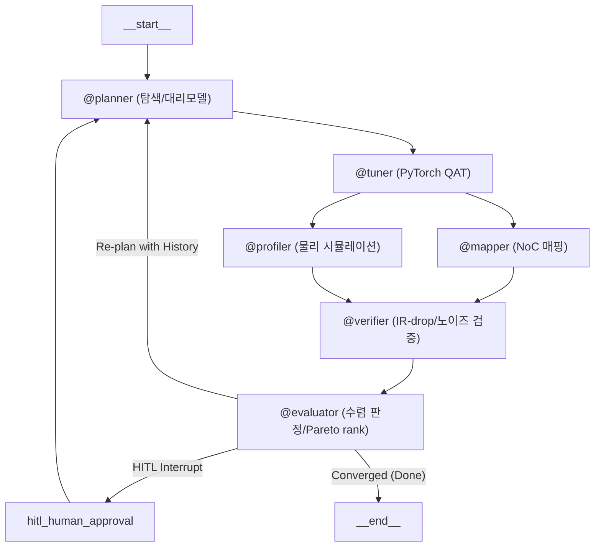

# AutoCIM-Agent

**CIM(Compute-In-Memory) 반도체를 위한 LangGraph 기반 6-에이전트 HW-SW 공동설계 최적화 프레임워크**

레이어별 양자화 비트/컬럼 프루닝 비율과 크로스바 하드웨어 제약(ADC/DAC 해상도, IR-drop, 소자 노이즈)을 함께 고려해, 정확도·에너지·지연시간의 Pareto 최적점을 자율적으로 탐색하는 폐루프(closed-loop) 에이전트 파이프라인입니다. 배경과 전체 설계 의도는 [`docs/research_plan.md`](docs/research_plan.md)를, 코드 작성 규칙은 [`CLAUDE.md`](CLAUDE.md)를 참고하세요.

## 아키텍처



| 에이전트 | 역할 | 실제 구현 여부 |
|---|---|---|
| `@planner` | LHS 워밍업 + IDW 대리모델/UCB 탐색(stage별 독립, 최대 40차원), LLM 도구 호출로 최종 확정 | 실제 |
| `@tuner` | 크로스바 정렬 fake-quantization + 구조적 컬럼 프루닝, 실제 QAT fine-tuning (`tools/qat.py`) | 실제 (CIFAR10 서브셋) |
| `@mapper` / `@profiler` | NoC 홉카운트/대역폭 매핑, ADC/DAC/크로스바 에너지·지연 물리 시뮬레이션 | 실제 (fast-approximation) |
| `@verifier` | IR-drop/노이즈 마진 기반 수렴 판정 | 실제 |
| `@evaluator` | Pydantic 스키마 검증, NSGA-II 스타일 Pareto rank, 재탐색/HITL 라우팅 | 실제 |

> **스코프 한계 (의도적으로 문서화됨):** `@mapper`/`@profiler`는 NeuroSim/CIM-Loop 같은 정밀 시뮬레이터가 아니라 물리 법칙 기반의 fast-approximation이며(`calibration_factors`로 보정), `@tuner`의 학습 데이터는 CIFAR10 512/128/1000장 서브셋입니다. 후보 간 **상대 비교**에는 신뢰할 수 있지만, 절대 수치를 그대로 벤치마크/제품 스펙으로 사용하지 마세요.

## 주요 기능
- **세션 영속성**: `SqliteSaver` 기반 체크포인트로 프로세스 재시작 후에도 `--thread-id`로 재개
- **HITL(Human-in-the-Loop)**: 수렴 정체 시 연구원 개입 요청 (dynamic `interrupt()`)
- **LLM 호출 운영**: 재시도/지수 백오프, rate-limit 대응, 토큰/비용 추적, 누적 비용·토큰 상한(kill-switch)
- **구조화된 관측성**: iteration별 JSON Lines 로그(`observability.py`) + 후보/Pareto front 이동을 보여주는 HTML 대시보드(`tools/dashboard.py`)

## 설치

```bash
pip install -r requirements.txt
```

CPU 전용 환경이라면 torch/torchvision을 CPU wheel로 먼저 설치해 다운로드 용량을 줄일 수 있습니다:

```bash
pip install torch==2.13.0 torchvision==0.28.0 --index-url https://download.pytorch.org/whl/cpu
pip install -r requirements.txt
```

## 실행

LLM provider/모델을 지정해야 합니다 (`langchain.chat_models.init_chat_model` 스펙 문자열):

```bash
export AUTOCIM_PLANNER_MODEL="anthropic:claude-sonnet-4-5-20250929"
export ANTHROPIC_API_KEY="..."

python main.py --model-id resnet18 --dashboard-out report.html
```

`@planner`는 `PlannerLayerDecision`을 forced tool-calling(`tool_choice=<정확한 도구 이름>`)으로 호출하는데, 이걸 실제로 지원하지 않거나 필수 필드를 빠뜨리는 provider/모델도 있습니다. 아래는 실제로 end-to-end(실제 resnet18+CIFAR10 QAT 포함) 검증된 조합입니다:

| Provider | 모델 | 비고 |
|---|---|---|
| Anthropic | `anthropic:claude-sonnet-4-5-20250929` | 기본 권장 |
| Groq (무료 티어 가능) | `groq:llama-3.3-70b-versatile` | `llama-3.1-8b-instant`는 `LayerBitConfig`의 필수 필드(`activation_bits`)를 종종 빠뜨려 실패함 -- 더 작은 모델로 바꾸기 전에 스키마 준수를 직접 확인할 것 |
| Google Gemini (무료 티어 가능) | `google_genai:gemini-3.5-flash-lite` | 스키마 준수 확인됨, 토큰 소모 적음. `gemini-3.5-flash`도 되지만 내부 reasoning 토큰 때문에 같은 요청에 ~2배 더 많은 토큰을 씀 |

Groq/Gemini를 쓰려면 `pip install -r requirements.txt`에 이미 포함된 `langchain-groq`/`langchain-google-genai`가 필요하고, 각각 `GROQ_API_KEY`/`GOOGLE_API_KEY` 환경변수를 설정하면 됩니다.

주요 CLI 옵션 (`main.py`):

| 옵션 | 설명 |
|---|---|
| `--model-id` | 대상 모델 (`resnet18`, `mobilenet_v2`, `vit_tiny`) |
| `--hw-config PATH` | `HWConfig` 필드를 담은 JSON 파일 (생략 시 내장 샘플 스펙 사용) |
| `--thread-id ID` | 세션 재개용 LangGraph thread id |
| `--checkpoint-db PATH` | 체크포인트 SQLite 경로 (`:memory:`로 영속성 끄기 가능) |
| `--dashboard-out PATH` | 세션이 멈추거나 끝날 때마다 HTML 대시보드를 이 경로에 기록 |

### 주요 환경변수

| 변수 | 용도 |
|---|---|
| `AUTOCIM_PLANNER_MODEL` | (필수) LLM provider:model 스펙 |
| `AUTOCIM_LLM_MAX_RETRIES` / `_BASE_DELAY_SECONDS` / `_MAX_DELAY_SECONDS` | LLM 호출 재시도/백오프 튜닝 |
| `AUTOCIM_LLM_COST_PER_1K_INPUT_USD` / `_OUTPUT_USD` | 토큰당 비용 추정 활성화 (미설정 시 비용은 항상 `null`) |
| `AUTOCIM_LLM_MAX_TOTAL_COST_USD` / `AUTOCIM_LLM_MAX_TOTAL_TOKENS` | 런 전체 누적 상한 도달 시 LLM 호출 자체를 중단 |
| `AUTOCIM_LOG_DIR` | 구조화 로그(JSONL) 저장 위치 (기본 `.cache/logs/`) |
| `AUTOCIM_QAT_TRAIN_SIZE` / `_VAL_SIZE` / `_TEST_SIZE` / `_BATCH_SIZE` | QAT fine-tuning/평가 데이터셋 크기 (기본 512/128/1000/32 — CIFAR10 데모 서브셋). `TRAIN_SIZE`/`TEST_SIZE`는 `full`로 설정하면 해당 split 전체 사용 (wall-clock 증가) |
| `AUTOCIM_QAT_SEED` | QAT train/val/test 분할 시드 (기본 0) |

## Docker

```bash
docker build -t autocim-agent .
docker run --rm -e AUTOCIM_PLANNER_MODEL=... -e ANTHROPIC_API_KEY=... autocim-agent --model-id resnet18
```

## 테스트

```bash
pytest
```

전부 stub 백엔드(가짜 LLM, 합성 모델/데이터)로 동작해 네트워크/실제 학습 없이 수 초 내 완료됩니다. `tests/conftest.py`의 autouse fixture가 실제 QAT 학습·LLM API 호출을 자동으로 가짜로 대체합니다. `.github/workflows/ci.yml`이 push/PR마다 동일하게 실행합니다.

## 프로젝트 구조

```
graph.py, main.py, state.py, llm.py, middleware.py,
observability.py, store.py   # 코어 오케스트레이션/런타임 (LangGraph 조립, 상태 스키마, LLM 운영, 구조화 로깅)
nodes/                        # 6개 에이전트 노드 함수
tools/                        # 백엔드 시뮬레이터 (QAT, 물리 시뮬레이션, 탐색 알고리즘, 대시보드)
schemas/                      # Pydantic 입출력 스키마
tests/                        # pytest 스위트 (전부 stub 기반)
docs/                         # 연구 계획서 등 부가 문서
```
