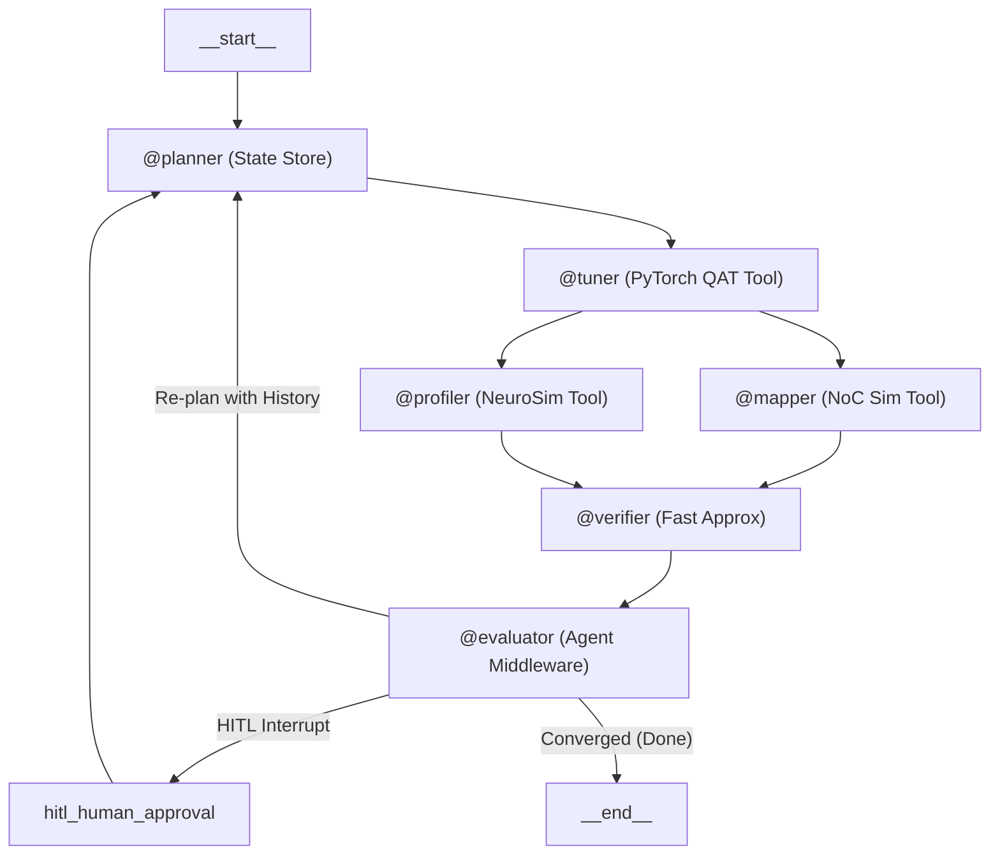

# [연구 계획서 / Research Plan]

> **이 문서는 프로젝트 초기 기획서입니다.** 구현이 진행되며 실제 아키텍처/알고리즘이 아래 내용과 달라진 부분이 있습니다 (예: `@precision_verifier` 노드 부재, "정규화 다중 목적 탐색" 서술이 실제 NSGA-II 리라이트 이전 상태). **현재 실제 구현을 반영한 아키텍처/설계 근거는 [`../README.md`](../README.md)를 기준으로 삼으세요.** 이 문서는 프로젝트의 최초 문제의식과 목표를 기록해두기 위해 그대로 남겨둡니다.

## AutoCIM-Agent: CIM 및 온디바이스 AI 환경을 위한 하드웨어 인지형 자율 멀티에이전트 모델 최적화 프레임워크

**AutoCIM-Agent: A CIM-Aware Autonomous Multi-Agent Framework for On-Device AI Model Optimization**

---

### 1. 연구 배경 및 문제 정의 (Background & Problem Statement)

온디바이스 AI 및 차세대 반도체 분야에서 **CIM(Compute-In-Memory)** 구조는 메모리와 연산기의 물리적 분리로 인한 병목을 극복할 수 있는 핵심 기술로 주목받고 있습니다. 그러나 CIM 칩 상에 딥러닝 모델을 효율적으로 탑재하기 위해서는 단순히 소프트웨어 차원의 가중치(Weight) 축소를 넘어, **CIM Crossbar 어레이 규격(예: 128x128), ADC/DAC 변환기 해상도, 배선 저항에 따른 전압 강하(IR Drop), 소자 노이즈** 등 복잡한 하드웨어 비이상적 특성을 고려한 **HW-SW Co-Design 최적화**가 필수적입니다.

기존의 HW-SW Co-Design 과정은 다음과 같은 한계를 가집니다.

1. **탐색 공간의 극심한 조합 폭발**: 레이어별 양자화 비트, 컬럼 프루닝 비율, 어레이 매핑 전략의 조합이 기하급수적으로 증가합니다.
2. **높은 시뮬레이션 오버헤드**: NeuroSim, CIM-Loop 등 HW 정밀 시뮬레이터 구동 및 누적 탐색에 상당한 시간이 소요됩니다.
3. **수동 반복 작업의 병목**: 엔지니어가 직접 파라미터를 수정하고 시뮬레이션을 재구동하는 정체 구간(Bottleneck)으로 인해 최적화에 수일에서 수주의 시간이 소요됩니다.
4. **LLM 단독 활용의 한계**: 거대 언어 모델(LLM)은 회로 연산 및 하드웨어 물리 수치를 직접 계산할 수 없어 수치 환각(Hallucination)이 발생합니다.

---

### 2. 제안하는 시스템 (Proposed Methodology)

본 연구에서는 이러한 문제를 해결하기 위해 LangGraph 기반의 6-에이전트 자율 최적화 프레임워크인 `AutoCIM-Agent`를 제안합니다. `AutoCIM-Agent`는 LLM의 추론 및 의사결정 능력과 백엔드 파이썬/C++ 시뮬레이터 코드(`@tool`)를 유기적으로 연결하여, 하드웨어 제약조건을 준수하는 최적의 경량화 조합을 자율적으로 탐색하는 폐루프(Closed-Loop) 시스템입니다.



* **자율 멀티에이전트 분업 및 병렬 처리 체계 (Specialized Roles & Parallel Execution)**
* `@planner` (기획/대리 모델): BO/NSGA-II 정규화 및 LHS 최소 샘플링 기반 대리 모델 수립 및 과거 이력 참조 탐색 경계 설정
* `@tuner` (모델 경량화): Crossbar 정렬 Layer/Column-wise 양자화 및 프루닝 수행 (Fast PTQ ➔ Pareto Top Bounded QAT)
* `@mapper` (하드웨어 매핑 - 병렬 구간): Multi-Tile Tiling, NoC Dataflow, 버퍼 지연 산출 및 Rule-based 가지치기 매핑
* `@profiler` (프로파일링/피드백 - 병렬 구간): 2-Stage Profiling 수행 및 Calibration Factor 기반 보정 데이터 수집
* `@verifier` (동적 검증 - 합성 구간): `@mapper`와 `@profiler` 결과를 합성하여 Fast Approximation 동적 입력 분포 및 IR Drop/노이즈 검증
* `@evaluator` (수렴/제어): Pydantic Schema 인터페이스 검증, State Store 이력 누적, 수렴도 평가 및 자율 피드백 라우팅


   * **서브에이전트 간 협업 및 피드백 메커니즘 (Collaboration & Feedback Mechanism)**
      * **하이브리드 병렬 실행 및 상태 합성 (Parallel Fan-out/Fan-in & State Reducer)**: `@tuner` 완료 후 `@mapper`와 `@profiler`를 동시 병렬 구동(Fan-out)하여 탐색 시간을 단축하며, Custom State Reducer(`merge_dicts`)를 통해 두 에이전트의 물리 수치를 충돌 없이 통합하여 `@verifier`로 합성(Fan-in)합니다.
      * **상태 공유 및 동적 제어 (State Sharing & Dynamic Routing)**: LangGraph 세션 메모리(`AutoCIMState`)를 매개로 에이전트 간 실행 상태를 전달하며, `@evaluator`가 수렴 완료(`Converged`), 연구원 판단 필요(`HITL Interrupt`), 이력 기반 재탐색(`Re-plan with History`)으로 실행 흐름을 동적으로 라우팅합니다.
      * **폐루프 피드백 및 지식 전이 (Closed-Loop Feedback & Knowledge Transfer)**: 미수렴 시 발생한 오차 수치를 단기 이력(`failure_history`) 및 장기 메모리(`runtime.store`)에 축적(`operator.add`)하여 `@planner`의 차세대 대리 모델 정밀도를 지속적으로 정교화합니다.

---

### 3. 기술 및 시스템 특징 (Core System Contributions)

* **Code-Centric Tool Calling 및 Context-Aware 실행 메커니즘 (`@tool`, `ToolRuntime`, `wrap_tool_call`)**
   * LLM은 오직 파라미터 판단 및 의사결정(`tool_calls`)만 수행하도록 역할을 격리합니다.
   * 프롬프트 오염 및 환각을 방지하기 위해 타겟 모델 및 하드웨어 식별자(`model_id`, `hw_spec_id`)를 **`ExecutionContext`** 메타데이터로 주입하며, 백엔드 툴 실행 시 `ToolRuntime`을 통해 프레임워크가 이를 자동 전달합니다.
   * 백엔드의 PyTorch 및 NeuroSim/CIM-Loop 파이썬 래퍼(`BaseTool`)는 주입된 `ToolRuntime`을 활용하여 LLM의 개입 없이 장기 메모리 저장소(`runtime.store`)의 해당 네임스페이스에 직접 접근해 조회(`get`/`search`) 및 갱신(`put`)을 안전하게 수행합니다.
   * **`wrap_tool_call`** 인터셉터 메커니즘을 적용하여 툴 실행 전·후 시점을 가로채 Pydantic 기반 인자 검증, 메타데이터 주입, C++/Python 예외 트레이스백 포착 및 결과 정제를 일관되게 처리합니다.
   * 미확인 커스텀 연산자의 수학적 구조 분석 및 최신 SOTA 경량화 하이퍼파라미터 가이드라인 참조를 위해 외부 학술 DB 검색 보조 툴(`@search_paper`) 연동 인터페이스를 제공합니다.


* **Crossbar 정렬 모델 경량화 및 Multi-Tile 병렬 매핑 (`@tuner`, `@mapper`, `@profiler`)**
   * CIM Crossbar 어레이 규격(128x128) 및 ADC/DAC 비트 해상도 등 하드웨어 물리 특성에 부합하는 Column-wise / Crossbar-aligned 프루닝 및 양자화를 수행합니다.
   * QAT 수행 시 연산 오버헤드를 제어하기 위해 Pareto Top 후보군 수 제한, 에포크 제약 및 조기 종료(Early Stopping) 기준을 설정합니다.
   * `@mapper`와 `@profiler`를 동시 병렬 구동하여 타일 간 Interconnect(NoC) 지연시간, 전력 소비, 버퍼 메모리 지연 산출과 정밀 프로파일링을 고속 처리합니다.
   * NoC 지연 시간이 지배적인 지점을 감지할 경우 탐색 공간을 효율적으로 단축하는 룰베이스(Rule-based) 가지치기 기법을 적용합니다.


* **신뢰성 높은 대리 모델 및 정규화 다중 목적 탐색 (`@planner`, `@profiler`)**
   * Warm-up 단계에서 초기 수집 오버헤드를 줄이기 위해 Latin Hypercube Sampling(LHS) 기반 최소 샘플링 전략을 도입해 대리 모델(Surrogate Model)의 정밀도를 확보합니다.
   * 추론 지연시간(Latency), 에너지, 정확도(Accuracy) 다중 목적 함수 탐색 시 명확한 스케일링 기준에 따른 정규화(Normalization)를 적용하여 정밀 시뮬레이터 호출 오버헤드를 단축합니다.


* **보정된 고속 근사 검증 및 동적 입력 피드백 (`@verifier`, `@profiler`)**
   * 핵심 레이어를 선별하고 고속 근사(Fast Approximation) 기법을 적용해 회로 연산 복잡도를 완화합니다.
   * 고속 근사 수치가 정밀 시뮬레이션 수치와 격차를 일으키지 않도록 보정 계수(Calibration Factor) 지속 업데이트 루프를 백엔드 시뮬레이터와 동기화합니다.
   * 다양한 입력 데이터 분포를 주입하는 검증 루프를 통해 보정 계수가 특정 대표 데이터셋에 편향되지 않도록 유연한 수렴을 보장합니다.


* **3계층 메모리 아키텍처, State Reducer 및 HITL 제어 루프 (`@evaluator`, `@planner`)**
   * **단기 메모리 및 State Reducer Store (`AutoCIMState`)**: Pydantic Schema 기반 실시간 파라미터 전달, 병렬 수치 데이터를 충돌 없이 합치는 Custom Reducer(`merge_dicts`), 과거 미수렴 이력을 지속 누적하는 리스트 Reducer(`operator.add`), 그리고 최대 재시도 횟수(Max Retry Limit) 기반 무한 루프 차단을 수행합니다.
   * **Target Model별 장기 메모리 (Model-Specific Long-Term Store)**: Raw `get` 방식을 통해 기존 모델의 민감도 지형도를 즉시 로드하고, 신규 모델 입점 시 Indexed `search` 기반 시맨틱 검색으로 구조적 유사 모델의 최적화 노하우를 전이(Knowledge Transfer)합니다. 최적화 완료 시 `store.put`으로 파레토 최적해 및 인덱싱 정보를 갱신합니다.
   * **글로벌 HW 장기 메모리 (Global HW-Aware Long-Term Store)**: CIM Crossbar 규격별 오차 보정 계수(Calibration Factor)와 NoC/버퍼 지연 룰베이스를 `store.put`으로 글로벌 영구 데이터베이스에 축적하여 반복 구동 오버헤드를 최소화합니다.
   * **자율 제어용 Agent Middleware 및 체크포인터**:
      * `wrap_tool_call` 파이프라인 기반 데이터 규격 검증 및 `ExecutionContext` 메타데이터 자동 주입을 수행합니다.
      * 불필요한 시뮬레이션 로그를 정제하는 Context Pruning과 과거 추론 맥락을 요약하는 `SummarizationMiddleware`를 병행 적용하여 토큰 오버플로우를 차단합니다.
      * API 장애 발생 시 대체 모델로 자동 우회하는 `ModelFallback` 및 예외 발생 시 스택 트레이스백 분석 기반 자율 오류 복구(Self-Correction) 파이프라인을 구축합니다.
      * LangGraph 내장 `MemorySaver` 체크포인터 및 동적 `interrupt()` 메커니즘을 결합하여 수렴 정체 시 안전하게 일시정지(Pause)하고 연구원(사용자)의 승인/조건 완화를 반영하는 휴먼 인 더 루프(HITL) 루프를 구동합니다.

---

### 4. 기대 효과 및 활용 방안 (Expected Impact & Applications)

* **탐색 시간 단축 및 개발 생산성 극대화 (Time-to-Solution Reduction)**
   * 수동 반복 작업 주기를 수시간 이내로 단축하며, 병렬 파이프라인 구동 및 대리 모델 기반 샘플링으로 시뮬레이션 병목을 해결합니다.
* **정교한 다중 목적 파레토 최적화 도출 (Balanced Pareto Optimization)**
   * 추론 지연시간, 에너지 효율, 정확도 간 Trade-off를 균형 있게 반영하여 실제 칩 배치 환경에 적합한 파레토 프론티어(Pareto Frontier) 결과물을 도출합니다.
* **반도체 설계 자동화(EDA) 패러다임 확장성 (EDA Automation & Scalability)**
   * LLM Multi-Agent 기반 자율 최적화 체계를 통해 반도체 설계 및 검증 자동화 패러다임을 정립하며 커스텀 NPU 및 CIM 반도체 제작 시 확장 이식할 수 있습니다.

---

### 키워드 (Keywords)

`Compute-In-Memory (CIM)`, `HW-SW Co-Design`, `LLM Multi-Agent Framework`, `LangGraph Parallel Execution`, `State Reducer`, `wrap_tool_call (Tool Interceptor)`, `Surrogate Model (LHS Sampling)`, `Fast Approximation & Dynamic Input Calibration`, `Multi-Tile NoC & Rule-based Pruning`, `Bounded QAT`, `Context Pruning`, `Hierarchical Memory Architecture`, `MemorySaver Checkpoint`, `Human-in-the-Loop (HITL)`, `Conditional Interrupt`, `Dual-Mode Store (Raw & Indexed)`, `Agent Middleware`, `Self-Correction`

---

### [부록] LangGraph 자율 최적화 파이프라인 구현 코드 (Appendix: Implementation Code)

```python
import operator
from typing import Annotated, Literal, TypedDict, List, Dict, Any
from langgraph.graph import StateGraph, START, END
from langgraph.checkpoint.memory import MemorySaver
from langgraph.types import interrupt

# ---------------------------------------------------------------------------
# 1. Reducer 정의
# ---------------------------------------------------------------------------
def merge_dicts(left: Dict[str, Any], right: Dict[str, Any]) -> Dict[str, Any]:
    if not left: return right or {}
    if not right: return left or {}
    merged = left.copy()
    merged.update(right)
    return merged

def namespaced_metrics_reducer(left: Dict[str, Any], right: Dict[str, Any]) -> Dict[str, Any]:
    """
    각 에이전트의 출력을 에이전트 ID/노드 이름별 네임스페이스로 격리하여 병합
    예: {"mapper": {...}, "profiler": {...}}
    """
    merged = left.copy() if left else {}
    if not right:
        return merged
    
    for key, value in right.items():
        if key in merged and isinstance(merged[key], dict) and isinstance(value, dict):
            merged[key] = {**merged[key], **value}
        else:
            merged[key] = value
            
    return merged

# ---------------------------------------------------------------------------
# 2. State Schema 정의
# ---------------------------------------------------------------------------
class AutoCIMState(TypedDict):
    messages: Annotated[list, operator.add]
    failure_history: Annotated[list, operator.add]
    metrics_store: Annotated[Dict[str, Any], namespaced_metrics_reducer]  # 네임스페이스 Reducer 적용
    calibration_factors: Annotated[Dict[str, float], merge_dicts]
    human_overrides: Dict[str, Any]
    model_id: str
    hw_spec_id: str
    current_step: str
    iteration_count: int
    retry_count: int
    is_converged: bool
    needs_hitl: bool

# ---------------------------------------------------------------------------
# 3. 노드(Node) 함수 정의
# ---------------------------------------------------------------------------
def planner_node(state: AutoCIMState) -> Dict[str, Any]:
    current_iter = state.get("iteration_count", 0) + 1
    overrides = state.get("human_overrides", {})
    
    if overrides:
        return {
            "current_step": "planner", 
            "iteration_count": current_iter,
            "needs_hitl": False,
            "retry_count": 0,
            "human_overrides": {}  # 정화(Sanitization) 처리
        }

    return {"current_step": "planner", "iteration_count": current_iter}

def tuner_node(state: AutoCIMState) -> Dict[str, Any]:
    return {"current_step": "tuner"}

def mapper_node(state: AutoCIMState) -> Dict[str, Any]:
    try:
        return {
            "metrics_store": {
                "mapper": {
                    "status": "SUCCESS",
                    "data": {"noc_latency_ms": 4.2},
                    "error": None
                }
            }
        }
    except Exception as e:
        return {
            "metrics_store": {
                "mapper": {
                    "status": "FAILED",
                    "data": None,
                    "error": str(e)
                }
            }
        }

def profiler_node(state: AutoCIMState) -> Dict[str, Any]:
    try:
        return {
            "current_step": "profiler",
            "metrics_store": {
                "profiler": {
                    "status": "SUCCESS",
                    "data": {"energy_pj": 12.4},
                    "error": None
                }
            }
        }
    except Exception as e:
        return {
            "current_step": "profiler",
            "metrics_store": {
                "profiler": {
                    "status": "FAILED",
                    "data": None,
                    "error": str(e)
                }
            }
        }

def verifier_node(state: AutoCIMState) -> Dict[str, Any]:
    return {"current_step": "verifier"}

def evaluator_node(state: AutoCIMState) -> Dict[str, Any]:
    is_converged = state.get("is_converged", False)
    new_history = [] if is_converged else [{"iteration": state.get("iteration_count", 1), "reason": "Target 지표 미달성"}]
    return {"current_step": "evaluator", "failure_history": new_history}

def hitl_node(state: AutoCIMState) -> Dict[str, Any]:
    # Dynamic Interrupt를 통해 연구원 입력 대기
    human_input = interrupt({"reason": "지표 미달성으로 인한 연구원 개입 요청"})
    return {
        "current_step": "hitl",
        "human_overrides": human_input.get("new_bounds", {}) if isinstance(human_input, dict) else {},
        "needs_hitl": False
    }

# ---------------------------------------------------------------------------
# 4. 라우터 및 그래프 구축
# ---------------------------------------------------------------------------
def evaluator_router(state: AutoCIMState) -> Literal["Converged (Done)", "HITL Interrupt", "Re-plan with History"]:
    if state.get("is_converged", False): return "Converged (Done)"
    if state.get("needs_hitl", False): return "HITL Interrupt"
    return "Re-plan with History"

workflow = StateGraph(AutoCIMState)

workflow.add_node("planner", planner_node)
workflow.add_node("tuner", tuner_node)
workflow.add_node("mapper", mapper_node)
workflow.add_node("profiler", profiler_node)
workflow.add_node("verifier", verifier_node)
workflow.add_node("evaluator", evaluator_node)
workflow.add_node("hitl_human_approval", hitl_node)

workflow.add_edge(START, "planner")
workflow.add_edge("planner", "tuner")
workflow.add_edge("tuner", "mapper")
workflow.add_edge("tuner", "profiler")
workflow.add_edge("mapper", "verifier")
workflow.add_edge("profiler", "verifier")
workflow.add_edge("verifier", "evaluator")
workflow.add_edge("hitl_human_approval", "planner")

workflow.add_conditional_edges(
    "evaluator",
    evaluator_router,
    {"Converged (Done)": END, "HITL Interrupt": "hitl_human_approval", "Re-plan with History": "planner"}
)

checkpointer = MemorySaver()

agent_log = workflow.compile(checkpointer=checkpointer)
```
